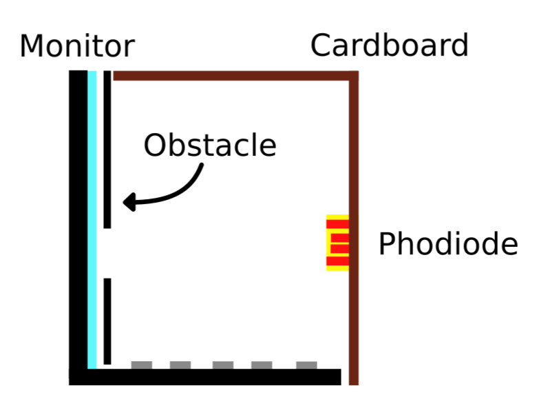

# The 1 pixel camera (OPC)

The One Pixel Camera (OPC) is a satirical electronic project that proves that a single photocell can shot unbelievable pictures.

|  |  |
| ------------------------------------------------------------ | ---------------------------------------------------------- |

## Bill of Materials (BOM)

Materials used in this project:

* Cardboard (of an old printer).

* ESP32 board.

* SSD1306 OLED.

* 10 kOhm photocell + 10 kOhm resistor.

* Processing and Arduino (IDE).

  

## ESP32 breadbord schematic

Here is showed the esp32 breadboard schematic

## How Shots are made

By positioning a black cardboard obstacle on the screen and activating a specific section at the appropriate moment, it is possible to determine whether the obstacle has been hit.

## Results

Two samples of picture shot with the one pixel camera.

|  |  |
| ------------------------------------------------------------ | ------------------------------------------------------------ |

|  |  |
| ------------------------------------------------------------ | ------------------------------------------------------------ |

## TODO

These "promising" results proved the point: One pixel camera is possible under certain conditions. Further steps should involve:

* Averaging subsequent swipes of individual cell in the matrix (improving shape detection).
* Increase the number of photodiode will increase sensitivity.

